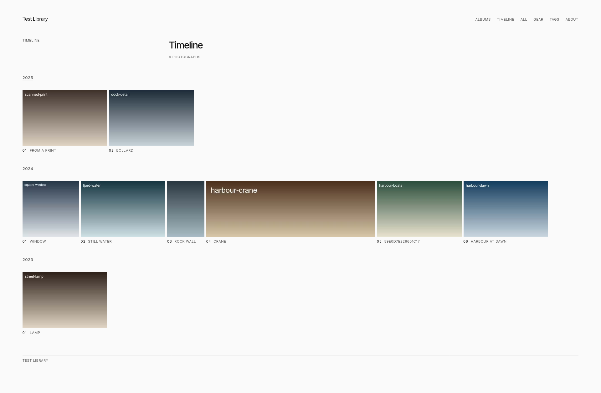

# exposer

A generator for a static photography site, derived from original photo files and XMP sidecars. The library is the only source of truth; the site is a build artifact you can delete and regenerate at any time.

Curation happens where the editing happens. A star rating in darktable decides what is published, hierarchical tags decide what a photograph belongs to, and nothing about a photograph is ever typed into this tool.

The generated static photography site is responsive, optimized for fast loading.

High-level work flow:
```
darktable → library (originals + .xmp) → exposer → static files → any web host
```

Example output:



## What it generates

Albums, tags, places, a timeline, a page per photograph, and a page per photograph *within each listing it belongs to*, so paging through an album stays inside that album. Plus an index, an "all" page, a gear page built from EXIF, an RSS feed and a sitemap. Every grid entry is a real link to a real page; there is no lightbox and under 1 KB of JavaScript on the whole site (gzipped), for the fullscreen view.

The output is plain files. No server runtime, no database, no request leaving the visitor's browser.

## Requirements

- [exiftool](https://exiftool.org/): for reading the library
- [ImageMagick](https://imagemagick.org/) 7 (`magick`), built with AVIF support: renders derivatives. On Debian that requires installing `libheif-plugin-aomenc` as well, which apt treats as optional; without it every AVIF fails with "no encode delegate". Ubuntu 24.04 LTS ships only ImageMagick 6, which has no `magick` command, so the build stops with "magick is required but did not run"; install ImageMagick 7 from [imagemagick.org](https://imagemagick.org/script/download.php) instead of apt
- [darktable](https://www.darktable.org/) (`darktable-cli`): only if your library holds RAW files
- [Hugo](https://gohugo.io/): for rendering the site. exposer requires Hugo 0.166.0. Under Linux, exposer pins the version it renders with, downloads it into your cache directory on first use, and checks it against a hash compiled into the binary. Otherwise, you must have Hugo 0.166.0 installed on `PATH` or you need to pass `--hugo <path>` (also for offline builds). Windows is currently not supported.

## Install

Download a binary from the [latest release](https://github.com/berb/exposer/releases/latest), check it, and put it on your `PATH`. For Linux on amd64:

```sh
base=https://github.com/berb/exposer/releases/latest/download
curl -LO "$base/SHA256SUMS"
file=$(grep linux_amd64 SHA256SUMS | awk '{print $2}')    # e.g. exposer_0.1.4_linux_amd64.tar.gz
curl -LO "$base/$file"
grep "$file" SHA256SUMS | sha256sum -c                    # on macOS: … | shasum -a 256 -c
tar xzf "$file"
sudo install "${file%.tar.gz}/exposer" /usr/local/bin/
exposer --version    # the release, and the Hugo version it renders with
```

Replace `linux_amd64` with `linux_arm64`, `darwin_amd64` or `darwin_arm64` as needed. Every archive is also attested by the workflow that built it: `gh attestation verify "$file" --repo berb/exposer` proves it came from this repository's release build. The macOS binaries are not signed by Apple: downloaded with `curl` as above they run as they are, but a copy downloaded in a browser has to be released from quarantine first with `xattr -d com.apple.quarantine exposer`.

Or, with Go 1.27 or newer:

```sh
go install github.com/berb/exposer/cmd/exposer@latest
```

Either way, the binary carries its theme and schema, so it runs from anywhere.

## Quickstart

```sh
exposer init ~/photos     # writes ~/photos/_data/exposer.yaml; edit base_url and title
exposer build ~/photos    # artifact in ./target/site
exposer serve             # http://127.0.0.1:8888
```

`exposer build -v` explains itself: which photographs were left out and why (rating below the gate, no sidecar, a duplicate), which were rendered rather than taken from the cache, and how long each stage took. `-q` prints nothing but errors.

`--target` puts the build elsewhere; the artifact is always `<target>/site`, and the caches beside it are what make the next build fast. `exposer build` runs five stages, each also available as a subcommand for running one at a time:

| Stage | What it does |
|---|---|
| `index` | reads the library into `target/index.json` |
| `derive` | renders every derivative, cached by content hash |
| `content` | writes Hugo content and data from the index |
| Hugo | renders HTML, and only HTML |
| `assemble` | hardlinks pages and derivatives into `target/site` |

The library is opened read-only: nothing here writes to an original or a sidecar, ever.

## The library

A library is a directory of originals with their sidecars beside them, arranged however you like — the tool walks the tree and does not care about the shape.

```
photos/
  2024/03/harbour-dawn.jpg
  2024/03/harbour-dawn.jpg.xmp
  _data/
    exposer.yaml
    albums/harbour.yaml
    locations/norway-bergen.yaml
    pages/about.md
    gear/dmc-g6.md
    tags/category-architecture.md
    featured_photos.yaml
```

Everything in `_data/` describes a *set* of photographs or the site itself — never a single photograph, which has its sidecar for that.

### What the sidecar decides

| In darktable | Becomes |
|---|---|
| Rating ≥ 4 (configurable) | published |
| `Album\|Harbour` | an album, at `/photos/albums/harbour/` |
| `Location\|Norway\|Bergen` | a place, and its parent `Norway` too |
| `Subject\|Street` | a tag page |
| `darktable\|…`, or any un-namespaced tag | filtered, never shown |
| Title, description | the page's title and caption, and its alt text |
| Capture date | the timeline, the year and month pages |

Camera and lens come from EXIF and become `Gear|Camera|…` and `Gear|Lens|…` automatically. Coordinates are never read from a photograph: a place is located by its `_data/locations/*.yaml` file, so a photograph taken at home does not publish where home is.

The build **fails** rather than skipping quietly: a published photograph with no capture date, or with no album, tag or place to be found under, stops the build and says which file it was.

## Configuration

`<library>/_data/exposer.yaml`, copied from `exposer.example.yaml`. It holds the site's identity and the derivative ladder — base URL, title, the rating gate, widths, formats and qualities. Changing a width or a quality changes the cache key, so the next build re-renders rather than serving stale pixels.

It lives in the library rather than beside the generator, so the directory you hand someone is the whole site and a build takes one argument. A library without one builds on the defaults. `--config` overrides it, for publishing the same photographs twice with different settings.

## Design

This is a themed generator, not a theming framework. The design is opinionated and lives in one place, the CSS at the top of `site-gen/layouts/baseof.html`: greys only, no rounded corners, no shadows, no gradients, one typeface, justified rows of photographs, and a layout that never moves after it paints. Self-hosted fonts, so no request leaves the visitor's browser.

If you want a different look, edit the theme. There is no configuration for it, on purpose.

## Development

```sh
make build    # the bundled test library, into target/site
make test     # the unit tests need nothing installed; the rest skip
make lint     # gofmt and go vet
```

The tests build `testdata/library` end to end and assert what the artifact must never do: publish an original, strand a photograph where nothing links to it, or produce different bytes from the same library twice. `testdata/README.md` maps every fixture photograph to the thing it covers.

## Documentation

- `CHANGELOG.md` — what changed in each release.
- `docs/spec.md` — the numbered specification. The code cites these IDs in its comments, and they are worth reading before changing anything.
- `AGENTS.md` — the invariants and the decisions behind them. Read it before changing how the build works.

## License

Apache 2.0.
